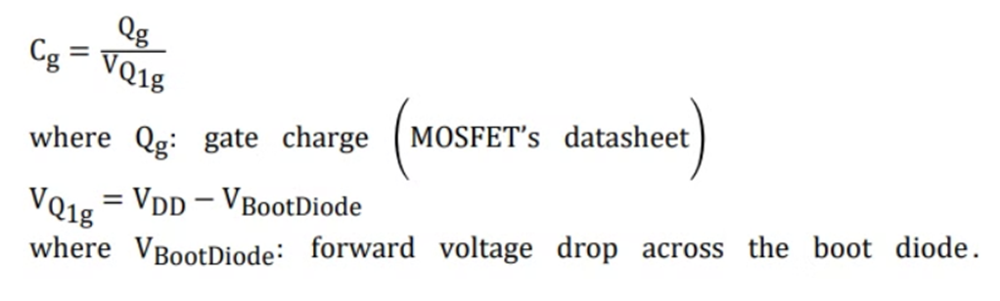
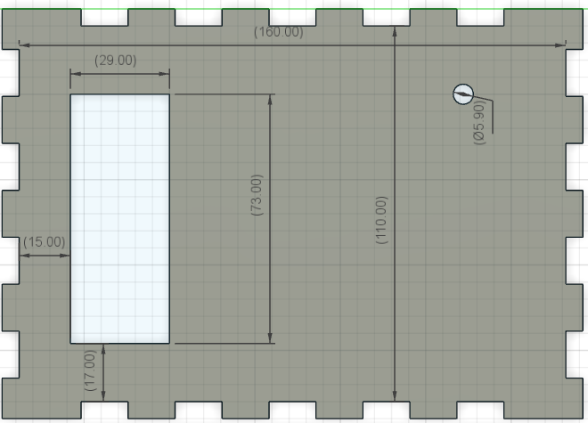

# High Current Sourcing Sine Wave Generator

Group Members -

1. Omkar Nitsure - 210070057
2. Ojas Karanjkar - 210070040
3. Kushal Gajbe - 210070048
4. Vaibhav Garg - 21d070085  
Github Link - [All files and code Contents](https://github.com/omkar-nitsure/High_Current_Sourcing_Sine_Wave_Generator)

## Introduction

Magnetic Materials are used in many application and in many different equipment for their special properties. But before using them, we need to have in-depth knowledge of their characteristics. This requires performing BH characterization. In BH characterization, we need to apply a sinusoidal voltage of varying amplitude and frequency across the magnetic material and check for the current it draws. Then the current and voltage information can be used to compute the value of B and H. The area enclosed by this curve is an indication of the amount of power dissipation in the material. This and other information is vital for choosing the right material for a specific application.

So, now we understand why BH characterization is important. We need a source which is able to generate a sinusoidal voltage with varying amplitude and frequency and source the current drawn by the magnetic material. The aim of our project is to design such a source.

This problem can be tackled either using a digital + analog or only analog approach. We tried both approaches. We designed an analog only circuit comprising of Class-AB amplifier and for the digital + analog we have used a Class-D amplifier based circuit. Let's discuss both the approaches in the following sections -

## Target Specifications

We were required to build a source satisfying the above constraints -

- Output Frequency = 2-3 kHz
- Output Sine amplitude = upto 30 Vpp
- Current Sourcing capacity = 1-1.5 A
- Added functionality of allowing user to change frequency on the go using a knob. - Display the current frequency on a LCD screen for ready reference

## Class Ab Based Circuit

In this approach, we designed a circuit which can be broken down in a Voltage amplification circuit and a Current sourcing circuit and connected them in cascade. The circuit diagram is as follows -

Figure 1: Circuit diagram for Class AB amplifier based circuit
The above circuit was giving the correct required output but there was an issue. There was a lot of power dissipation in the different BJTs which would have required big heat sinks and also a lot of power would have got wasted along with the unavoidable power loss due to eddy currents. We tried changing a lot of different parameters but we were not able to reduce the power-loss to the desired levels. While we were searching for the potential solution, we came across class-D amplifier which was not having the issue of power loss. After a lot of brainstorming, we decided to scrap this approach and continue with the approach involving Class-D amplifier.

## Class D Amplifier

Class D amplifier consists of a full-bridge MOSFET based circuit. Each of the 4 MOSFETs are fired by 4 different PWM signals across their gate-source. Two MOSFETs in the same leg get complementary PWM signal such that there ON times are separated by a non-zero dead time.

This dead-time is provided to ensure that there is sufficient time for the MOSFETs to change their states ensuring that both MOSFETs don't turn-on together and short Vdd with GND.

The duty ratio of the PWM signals vary sinusoidally which enables the output to be sinusoidal.

Duty ratios of the 4 PWM signals are as follows -

$$d_{1}={\frac{1}{2}}+m s i n(\omega t)$$
$$d_{2}={\frac{1}{2}}-m s i n(\omega t)$$

Then d3 and d4 are just complements of d1, d2 respectively seperated by dead time.

Figure 2: full-bridge MOSFET based circuit

## A. Simulations

We performed the LTSpice simulations of class D amplifier for our required specifications and got desired results. We generated the sinusoidally varying PWM signals by giving a triangular wave and a sine wave as inputs to a comparator. We kept zero dead time assuming perfect switching of MOSFETs. The MOSFETs were switching at a frequency of 100kHz and we tested the sinusoidal outputs for frequencies till 3kHz which was our target specification. We also checked for the power dissipation in the entire circuit(in all components) and found that they were in mW. Thus this approach allowed us to generate sine waves of large amplitudes for frequencies upto 3kHz without requiring any heat-sink at all!! This approach has some cons but that is a trade-off for excellent efficiency. The main limitation of this approach is that it generates saw-tooth noise because of MOSFET switching whereas a purely analog approach will not add any such noise. The results of our simulations are given below where the output voltage across the inductive load is given at the edge of our required specifications. We also give the corresponding current drawn by the inductive load which is well within our specifications.

Figure 3: output voltage across load

Figure 4: Current through the inductive load

## B. Choice Of Bom And Justifications

The Bill of Materials required for our circuit is as follows -

Figure 5: Bill of Materials

Gate Drivers - The PWM output cannot be directly given to the gates of MOSFETS as the back-currents generated while a MOSFET is turning-OFF will certainly damage the GPIO
pins on the Micro-controller. We wanted to have a gate driver which can amplify the rail-to-rail logic of 3.3 V coming from the micro-controller to rail-to-rail logic of 15V. We also wanted the current sinking capacity to be high which will allow us to switch at much higher frequency. Thus we chose the 2ED02012-FI gate driver from Infenion STM32 minimum package called Bluepill was more than sufficient for our ap-
Bluepill -
plication. It was able to generate the 4 independent PWM signals. It also had ADC which was used to provide the functionality of a knob for changing the output frequency to the user. We also needed 4 additional analog pins to write current frequency value on the LCD display. All of these requirements were satisfied by Bluepill.

RC filter at the input of the gate driver - This low-pass filter was used to remove the high-frequency peaks in the PWM outputs of the microcontroller.

MOSFET - We wanted to produce output sinusoidal signals of 30 Vyp and thus the Vas specifications of the MOSFETs must be larger than this value. We also wanted to source currents upto even 2A and thus the Ids rating must be larger than this value. We also wanted the MOSFET
to be a power MOSFET having the capability of very fast switching. MOSFET named IRF840 satidfied all these constraints and thus we chose that MOSFET for the circuit. LC circuit at the output - We had to use a low-pass filter at the output of a Class-D
amplifier to remove the saw-tooth noise added due to switching. We could have used a RC
filter but that would have resulted in large power-loss in the resistor, so we chose to use LC
filter of appropriate value which would not cause any power-loss.

## Microcontroller Programming

We generate the PWM signal with Sinusoidally varying dead time using the STM32 Bluepill microcontroller. The microcontroller clock frequency is 8MHz. The internal circuitry increases it such that the timers(which we used) get a frequency of 64MHz while the ADC sampling frequency is 8MHz. We decided to keep the switching frequency to be 100kHz which is almost 33 times larger than the maximum rated frequency of our system. It is also well within the maximum attainable switching frequency by the Power MOSFET. We have kept the cut-off frequency to be 12kHz which is less than 10 times the maximum rating. Let us now see how did we generate the PWM signal with sinusoidally varying duty ratio.

## A. Pwm Generation

We used 2 channels from TIM1 on the STM32. Each of these channels have a register named CCR which can be used to manipulate the duty ratio of the microcontroller. So, we stored the values for 1 cycle of the sinusoidal signals corresponding to d1 and d2 in the memory and read those values after a frequency dependent delay. This allowed us to generate sinusoidally varying PWM. Dead-time was also provided to ensure proper switching without any shorting which might damage the MOSFETs. We used a constant dead time of 0.125 us

## B. Adc Interfacing

We wanted to give a simple knob-based control to the user which he can use to set the output frequency he wants. This knob was made using a potentiometer circuit where the ends of the potentiometer are connected to the GND and 3.3V of the microcontroller. The middle pin is connected to the ADC and the values of voltage read using the ADC are then mapped to appropriate frequencies. The ADC is sampled every 1000 cycles to ensure that we don't sample "too often".

## C. Lcd Interfacing

We have also interfaced the LCD with the system so that user can see the current frequency output from the system in real time and adjust the knob accordingly to set the frequency of his choice. We implement the interfacing with 6 pins, 4 of which are the actual data pins. We write the frequency value after every 1000 cycles right after sampling the ADC. Thus we ensure that we don't write to the LCD "too often". The CAD model was then made accordingly to ensure that the LCD is clearly visible to the user.

Figure 6: LCD in the final prototype

## D. Microcontroller Pinout

The final microcontroller pinout after setting all the GPIO pins and interfacing the ADC and LCD is as follows -
s_JTCK-SW

Figure 7: STM32 pinout

## Schematics

Having selected the class D amplifier as the base of our power amplifier, we started making the overall complete circuitry for our prototype. As we have seen so far, our circuit majorly consists of 3 parts, viz

1. Microcontroller - For generating PWM signals.
2. Gate Drivers - For interfacing microcontroller with MOSFETs.
3. Full-bridge MOSFET
In our circuit, we have directly used Blue-Pill, which is a miniature version of NUCLEO-
F103RB STM32 evaluation board. The reason for going with blue-pill is simply because it contains all of the features of NUCLEO board we required and moreover, it is smaller in size.

However, one main issue while using blue-pill is that it does not have emulator part, which is present in NUCLEO board, making it difficult to dump code onto it. We had to use the ST-Link debugger everytime we wanted to dump our code onto blue-pill.

Moving onto the next part of our circuit, we have Gate Drivers. We chose the 2ED020I12-FI
IC manufactured by Infineon. The IC can sustain high voltage up to 1.2kV, supplying currents up to 1A or -2A. The PWM signals generated by the blue-pill were then fed to the gate drivers through the RC filter. This reduces the spike levels due to switching in the microcontroller.

A major part of the gate driver circuitry is the Bootstrap circuit at the high-side output of the gate driver IC. The bootstrap circuitry is used to supply bias to high-side FET. When the low-side FET is ON, the HS pin and source of the high-side FET are pulled to the ground.

As a result, the bootstrap capacitor is charged to Vdd. When the high-side FET is ON in the next cycle, the bootstrap capacitor discharges some of its charge to the gate of FET, thereby creating some positive Vgs and turning on the FET. Schottky diode is used as the bootstrap diode because of its ability to switch at high frequencies. Calculation of bootstrap capacitance is an important step while designing the bootstrap circuit. The value of bootstrap capacitor is calculated according to the given formula -

Figure 8: Gate Driver Circuit
For IRF540N, the value of gate charge is 66nC, and for 1N5822 Schottky diode, the forward voltage drop is 0.525 V, and Vdd = 15V. Plugging the values in above formula gives, Cg =
4.56 nF The minimum value of bootstrap capacitance should be chosen such that, Cboot =
10xCg Therefore, the value of bootstrap capacitor should be atleast 45nF. Apart from that, we also need to add a bypass capacitor value to Vdd, and the value of bypass capacitor should be atleast 10x the bootstrap capacitance. Therefore, Cbypass should be atleast 450nF.

Now, finally, once we have the pulses at the output of gate drivers, they are passed onto the respective gates of the FETs. The pulses are passed onto the gates of FETs through a resistor.

The output is observed between the source of the two high-side FETs. An electrolytic capacitor is connected between the Vdd and GND and ceramic capacitors need to be connected betweent the drain and ground of each FET. A simple low pass filtering is performed at the output to

Figure 9: Class-D amplifier
remove spikes due to switching.

We have also added a provision in our circuit to control the frequency using a knob. The knob is connected to a 10kΩ potentiometer. Based on the voltage at the middle terminal of the the voltage is sensed by the ADC in the blue-pill and it is mapped to the corresponding frequency value. The current frequency value is displayed using an LCD. Finally, putting all parts together, we get our final circuit schematics.

Figure 10: Full circuit schematics

## Intermediate Testing

## A. Pwm Generation

As descibed in 5.1, we generated the PWM signals using STM32 and tested. The output is shown in the image below.

Figure 11: PWM testing

## B. Adc Interfacing

We were able to interface a potentiometer with the microcontroller using an ADC successfully.

## C. Breadboard Testing

## Pcb Design

We designed the PCB using the KiCAD software. Various layout rules such as obtuse angles between tracks, decoupling capacitors, and correct placement of components were taken care of. We have used both SMD and THT components in our design. We have majorly used SM
components for decoupling capacitors and the gate driver IC. We have used screw terminals for connecting the inputs to the PCB. The blue pill is mounted on the PCB using a breakout board.

Figure 12: PCB Layout

Figure 13: PCB with all components

Figure 14: PCB for breakout board

Figure 15: Final PCB

## Cad Design

For our CAD design, we initially planned a 3D box structure using Fusion 360 software. The design process involved careful planning to ensure accessibility to certain components from the outside world while the prototype remains inside the box.

## A. Design Requirements

1. LCD Display: The design incorporates an open area for the LCD display to allow users to observe the frequency without obstruction.

2. Input and Outputs:

- Power Supply: A 5V supply is provided through a USB cable, which is also utilized for burning code onto the STM32 microcontroller.
- External Supplies: Vdrive and Vdd are supplied externally.
- Output Access: The output across the capacitor is also accessible through an opening on the 3D box.
- Potentiometer: A potentiometer is mounted on the box which will be used for controlling the frequency of the prototype. Thus, certain areas must be opened up on the box for the same.

Figure 16: 3D box CAD design
However, after discussing the design with the faculty we concluded that 3D printing the box is not possible, and hence we would have to use acrylic sheets laser cutting to make our box.

Now, makercase was used for making the dxf file which has the thickness of the sheet, length, and width for each side of the box. After importing this dxf file into the Fusion 360 software, we cut out the same regions as in the 3D box design.

Figure 17: Acrylic sheets design for the box

|  |  |
| ----------------------------------- | ----------------------------------- |
| (a) Top side                        | (b) Bottom side                     |

|  |  |
| ----------------------------------- | ----------------------------------- |
| (c) Front view side                 | (d) Side view                       |

Figure 18: Dimensions and open areas in the design.

## Final Prototype

Figure 19: Final Prototype

## Results

Figure 20: Final output Sine waveform
Our final output waveform is a sine wave meticulously designed for the characterization of magnetic materials. The waveform is derived from three power sources: Vdrive, Vdd, and a 5V supply via USB to the Nucleo board. The output signal is measured across a 470nF capacitor. Our setup achieves a current rating of 1.4 A, with the peak-to-peak voltage (Vpp) reaching up to 30 V at a frequency of 500Hz.

Figure 21: Gate Driver output

The output from the gate driver pertains to the high side. As anticipated, it effectively amplifies the PWM signal from the microcontroller. We are able to achieve 18.6 V of peak-topeak voltage output from the gate driver.

Figure 22: Microcontroller output. 
Above is the microcontroller PWM output. This goes as an input to our gate drivers. This PWM peak-to-peak voltage is 3.84 V. This is then amplified to 18.6 V by the gate drivers.
